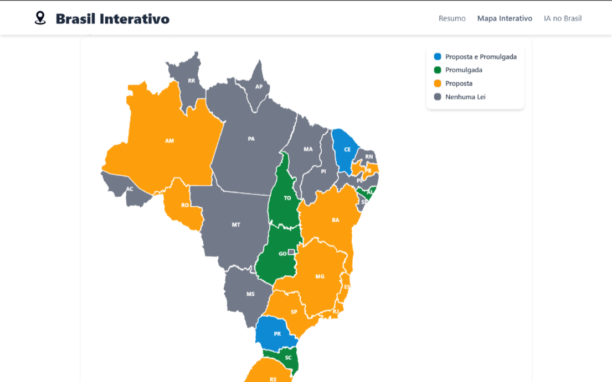
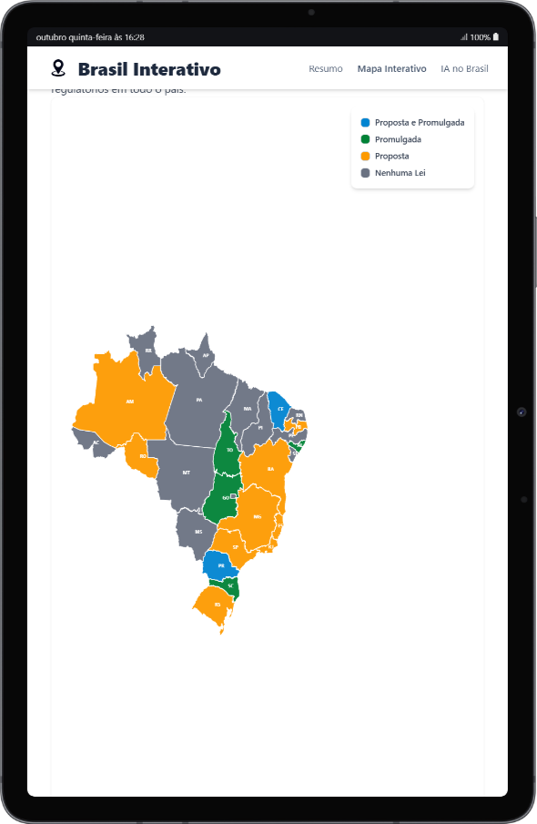
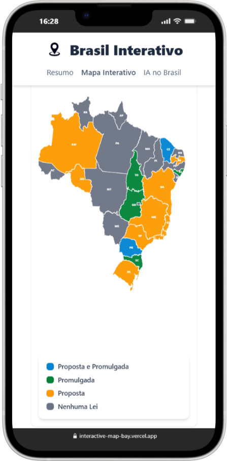

# 🗺️ Brasil Interativo - Mapa com as Leis de IA no Brasil

Este projeto é um mapa interativo do Brasil que permite visualizar as leis e projetos de lei sobre Inteligência Artificial (IA) em cada estado brasileiro. Inspirado pelo [mapa de legislação dos EUA criado pelo BCLP](https://www.bclplaw.com/en-US/events-insights-news/us-state-by-state-artificial-intelligence-legislation-snapshot.html), a aplicação busca centralizar e facilitar o acesso a essas informações, fornecendo um panorama atualizado da legislação de IA no país.

🔗 Link para o projeto: https://interactive-map-bay.vercel.app/

## 🚀 Funcionalidades

- ✅ **Mapa Interativo do Brasil**: Navegação pelo mapa do Brasil de forma visual e intuitiva.
- ✅ **Legenda informativa**: Legenda para informar o status de cada estado brasileiro.
- ✅ **Visualização por Estado**: Informações detalhadas sobre as leis de IA correspondentes.
- ✅ **Informações sobre a Legislação**: Acesso a detalhes, status e links para os textos completos das leis e projetos de lei.
- ✅ **Interface Responsiva**: Site responsivo, com interação funcionando tanto em Desktop, Tablet e Mobile.

## 🛠️ Tecnologias usadas

- **Frontend** - Next.js
- **Mapa** - React Simple Maps
- **Estilização** - Tailwind CSS

## 📱💻 Visualizações

O site é totalmente responsivo e se adapta a diferentes tamanhos de tela.  
Confira abaixo como ele se comporta em diferentes dispositivos:

### 🖥️ Versão Desktop



### 💻 Versão Tablet



### 📱 Versão Mobile



## Como executar Localmente

Siga os passos abaixo para executar o projeto na sua máquina local.

1. Clone o repositório

```bash
git clone https://github.com/joseajr17/interactive-map.git
```

2. Acesse o diretório do projeto:

```bash
cd interactive-map
```

3. Instale as dependências:

```bash
# Se você usa npm
npm install

# Se você usa yarn
yarn install

# Se você usa pnpm
pnpm install
```

4. Inicie o servidor de desenvolvimento:

```bash
# Se você usa npm
npm run dev

# Se você usa yarn
yarn dev

# Se você usa pnpm
pnpm dev
```

5. Acesse http://localhost:3000 (ou a porta indicada no seu terminal) para ver a aplicação rodando.


## 📜 Licença
Todos os direitos reservados ©Copyright - José Antonio